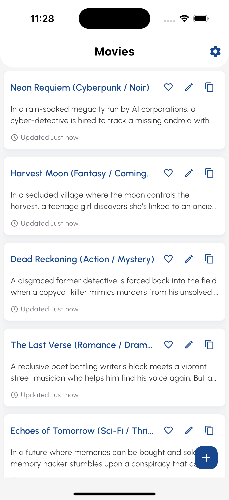
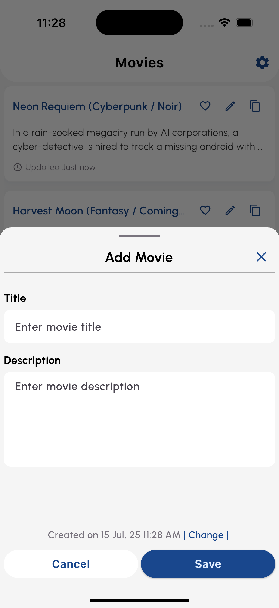
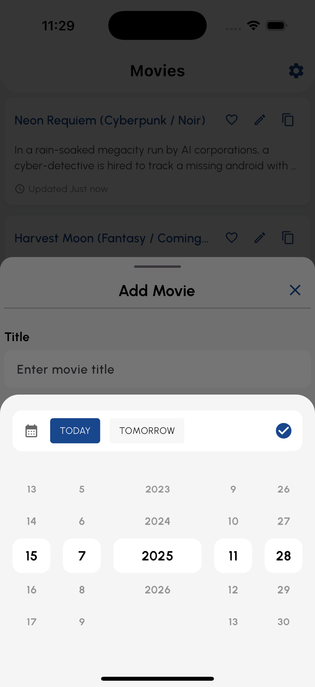
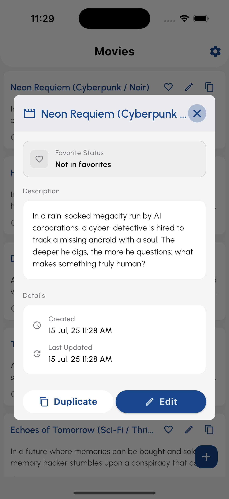
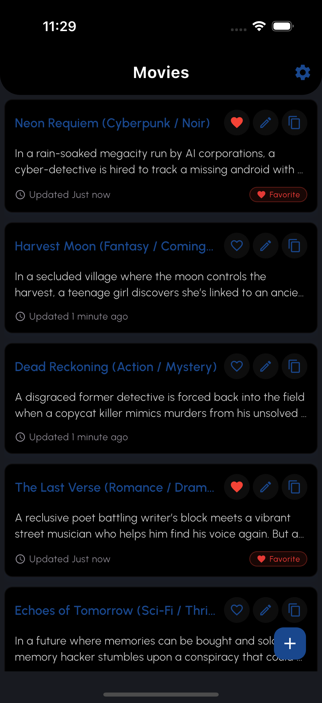
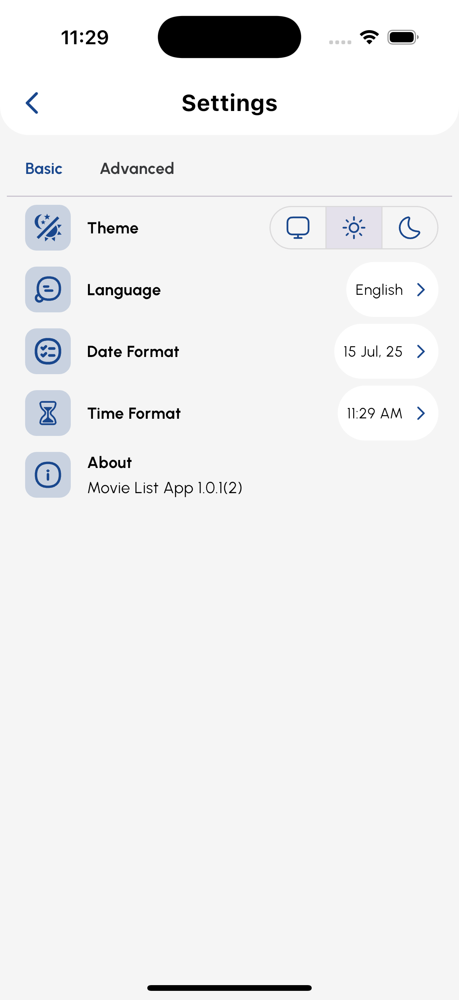

# Movie List App 🎬

A modern Flutter application for managing your personal movie collection with a clean, intuitive interface and comprehensive features.


## 📱 Screenshots

<div align="center">
  
  
  
  
  
  
</div>

## ✨ Features

### Core Functionality
- **📝 Movie Management**: Add, edit, and delete movies from your personal collection
- **⭐ Favorites System**: Mark movies as favorites for quick access
- **🔍 Movie Details**: View comprehensive information including descriptions, creation dates, and last updated timestamps
- **📅 Date/Time Tracking**: Automatic tracking of when movies were added and last modified
- **🔄 Duplicate Protection**: Create copies of existing movies with new IDs

### User Experience
- **🌓 Theme Support**: Light, Dark, and System themes with beautiful UI transitions
- **🌍 Internationalization**: Multi-language support (English, Bengali) with RTL support
- **📱 Responsive Design**: Optimized for various screen sizes and orientations
- **⚡ Performance**: Smooth animations, shimmer loading effects, and optimized rendering
- **🎨 Modern UI**: Material Design 3 with custom fonts (Urbanist, Signatra) and beautiful icons

### Advanced Settings
- **🎛️ Customizable Date/Time Formats**: Choose your preferred date and time display formats
- **🌐 Language Selection**: Switch between supported languages seamlessly
- **🔧 Advanced Options**: Performance overlay toggle, database management tools
- **💾 Data Persistence**: Reliable local storage using Hive database

## 🏗️ Architecture

This app follows a **clean architecture** pattern with clear separation of concerns:

```
lib/
├── src/
│   ├── app.dart                    # Main app configuration
│   ├── core/                       # Core utilities and configurations
│   │   ├── config/                 # App constants and configurations
│   │   ├── db/                     # Database setup and management
│   │   ├── router/                 # Navigation and routing
│   │   ├── shared/                 # Reusable widgets and utilities
│   │   └── utils/                  # Extensions, themes, and helpers
│   ├── features/                   # Feature-based modules
│   │   ├── home/                   # Movie management feature
│   │   │   ├── model/              # Movie data models
│   │   │   ├── provider/           # State management (Riverpod)
│   │   │   └── view/               # UI components and screens
│   │   └── settings/               # App settings feature
│   │       ├── model/              # Settings data models
│   │       ├── provider/           # Settings state management
│   │       └── view/               # Settings UI components
│   ├── localization/               # Internationalization files
│   └── injector.dart               # Dependency injection setup
└── main.dart                       # App entry point
```

### Key Technologies
- **🔄 State Management**: Riverpod for reactive state management
- **💾 Local Database**: Hive for fast, local data persistence
- **🧭 Navigation**: GoRouter for declarative routing
- **🎨 UI Components**: Custom widgets with Material Design 3
- **🌐 Localization**: Flutter's built-in i18n support
- **🧪 Testing**: Comprehensive unit tests with proper mocking

## 🚀 Getting Started

### Prerequisites
- **Flutter SDK**: ^3.8.1
- **Dart SDK**: ^3.8.1
- **Android Studio** or **VS Code** with Flutter extensions
- **Xcode** (for iOS development on macOS)

### Installation

1. **Clone the repository**
   ```bash
   git clone https://github.com/sabikrahat/movie_list_app.git
   cd movie_list_app
   ```

2. **Install dependencies**
   ```bash
   flutter pub get
   ```

3. **Generate necessary files**
   ```bash
   # Generate Hive adapters and other build_runner files
   dart run build_runner build
   
   # Generate app icons
   dart run flutter_launcher_icons:main
   
   # Generate native splash screens
   dart run flutter_native_splash:create
   ```

4. **Run the app**
   ```bash
   # Debug mode
   flutter run
   
   # Release mode
   flutter run --release
   
   # For specific platform
   flutter run -d chrome          # Web
   flutter run -d ios             # iOS
   flutter run -d android         # Android
   ```

### Platform Support
- ✅ **Android** (API 23+)
- ✅ **iOS** (iOS 12+)
- ✅ **Web** (Chrome, Firefox, Safari, Edge)
- ✅ **Windows** (Windows 10+)
- ✅ **macOS** (macOS 10.14+)
- ✅ **Linux** (Ubuntu 18.04+)

## 🧪 Testing

The app includes comprehensive unit tests to ensure reliability and maintainability.

### Running Tests

```bash
# Run all tests
flutter test

# Run tests with coverage
flutter test --coverage

# Run specific test files
flutter test test/unit/models/
flutter test test/unit/providers/

# Run tests in verbose mode
flutter test --reporter expanded
```

### Test Structure

```
test/
├── helpers/
│   └── hive_test_helper.dart       # Test utilities for Hive setup
├── unit/
│   ├── models/
│   │   └── movie_model_test.dart   # Movie model unit tests
│   └── providers/
│       └── home_provider_basic_test.dart  # Provider unit tests
└── README.md                       # Testing documentation
```

### Test Features
- **🏗️ Proper Setup/Teardown**: Automated Hive database initialization and cleanup
- **🔄 State Management Testing**: Comprehensive Riverpod provider testing
- **📊 Data Model Testing**: JSON serialization, equality, and edge cases
- **🧹 Test Isolation**: Each test runs in a clean environment
- **📈 Coverage**: High test coverage for critical business logic

### Writing New Tests

When adding new tests, follow these guidelines:

1. **Use the test helper** for Hive initialization:
   ```dart
   import '../../helpers/hive_test_helper.dart';
   
   setUpAll(() async {
     await HiveTestHelper.initializeHive();
   });
   
   tearDownAll(() async {
     await HiveTestHelper.cleanupHive();
   });
   ```

2. **Test async operations** properly:
   ```dart
   test('should handle async operations', () async {
     // Your async test code here
   });
   ```

3. **Mock external dependencies** when necessary using the `mockito` package.

## 📦 Dependencies

### Core Dependencies
- **flutter_riverpod**: ^2.6.1 - Reactive state management
- **hive_ce**: ^2.11.3 - Local database solution
- **go_router**: ^16.0.0 - Declarative routing
- **flutter_easyloading**: ^3.0.5 - Loading indicators
- **get_it**: ^8.0.3 - Dependency injection

### UI/UX Dependencies
- **flutter_svg**: ^2.2.0 - SVG image support
- **lottie**: ^3.3.1 - Beautiful animations
- **shimmer**: ^3.0.0 - Loading shimmer effects
- **flutter_spinkit**: ^5.2.1 - Loading spinners

### Development Dependencies
- **build_runner**: ^2.5.4 - Code generation
- **hive_ce_generator**: ^1.9.2 - Hive adapter generation
- **flutter_launcher_icons**: ^0.14.4 - App icon generation
- **mockito**: ^5.4.6 - Testing mocks
- **flutter_lints**: ^6.0.0 - Dart linting rules

## 🛠️ Build and Deployment

### Building for Production

```bash
# Android APK
flutter build apk --release

# Android App Bundle
flutter build appbundle --release

# iOS
flutter build ios --release

# Web
flutter build web --release

# Windows
flutter build windows --release

# macOS
flutter build macos --release

# Linux
flutter build linux --release
```

### App Icons and Splash Screen

The app uses **flutter_launcher_icons** and **flutter_native_splash** for consistent branding across platforms:

- **App Icon**: `assets/icons/app-icon-1024x1024.png`
- **Splash Screen**: `assets/icons/native_splash/logo.png`
- **Branding**: `assets/icons/native_splash/branding.png`

To regenerate icons and splash screens:
```bash
dart run flutter_launcher_icons:main
dart run flutter_native_splash:create
```

## 🎨 Customization

### Adding New Themes
1. Create theme files in `lib/src/core/utils/themes/`
2. Update the theme provider in `lib/src/features/settings/provider/theme_provider.dart`
3. Add theme options to the settings UI

### Adding New Languages
1. Create new `.arb` files in `lib/src/localization/`
2. Update `l10n.yaml` configuration
3. Run `flutter gen-l10n` to generate localization files
4. Add language options to the locale provider

### Custom Fonts
The app uses **Urbanist** as the primary font family with multiple weights (100-900) and **Signatra** for decorative text. Add new fonts by:
1. Adding font files to `assets/fonts/`
2. Updating `pubspec.yaml` font configuration
3. Using the fonts in your theme or widgets

## 🔧 Troubleshooting

### Common Issues

**1. Build Runner Issues**
```bash
# Clean and regenerate
flutter packages pub run build_runner clean
dart run build_runner build --delete-conflicting-outputs
```

**2. Hive Database Issues**
```bash
# Clear app data and restart
flutter clean
flutter pub get
```

**3. Platform-specific Issues**
```bash
# iOS pod issues
cd ios && pod install

# Android gradle issues
cd android && ./gradlew clean
```

**4. Test Failures**
- Ensure Hive database is properly initialized in tests
- Check that all async operations are properly awaited
- Verify mock setup for external dependencies

## 🤝 Contributing

1. **Fork** the repository
2. **Create** a feature branch: `git checkout -b feature/amazing-feature`
3. **Make** your changes following the project's coding standards
4. **Add** tests for new functionality
5. **Commit** your changes: `git commit -m 'Add amazing feature'`
6. **Push** to the branch: `git push origin feature/amazing-feature`
7. **Submit** a pull request

### Code Standards
- Follow Dart/Flutter best practices
- Use meaningful variable and function names
- Add documentation for public APIs
- Ensure all tests pass before submitting
- Follow the existing project structure

## 📄 License

This project is licensed under the MIT License - see the [LICENSE](LICENSE) file for details.

## 🙏 Acknowledgments

- **Flutter Team** for the amazing framework
- **Riverpod** for excellent state management
- **Hive** for fast local storage
- **Material Design** for UI/UX guidelines
- **Font Awesome** and custom icon designers for beautiful icons

## 📞 Support

For support, email sabikrahat72428@gmail.com or create an issue in the repository.

---

**Made with ❤️ using Flutter**